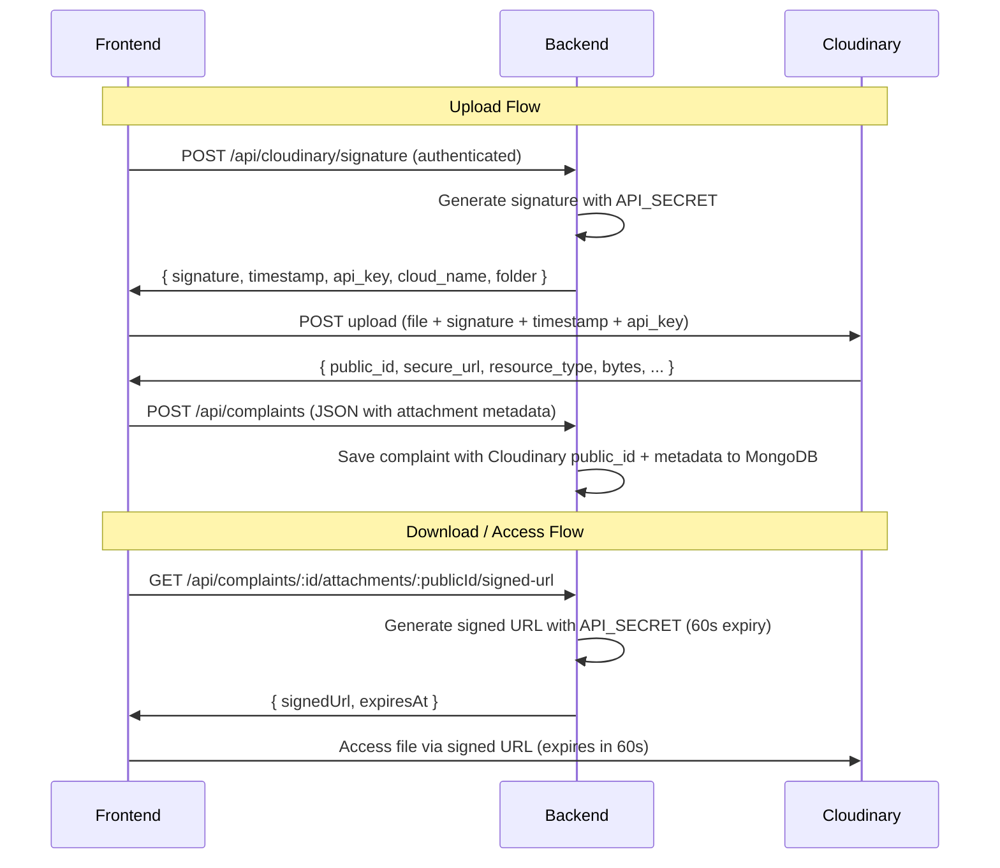

# Replace Local File Storage with Cloudinary (Signed Upload + Signed URLs)

Replace the current Multer → `uploads/` folder system with Cloudinary using:
- **Signed uploads** (backend generates signature, frontend uploads directly to Cloudinary)
- **Private delivery type** (`type: "authenticated"`) so files are NOT publicly accessible
- **Signed URLs** with 60-second expiry for controlled access/download

---

## Architecture Overview



## User Review Required

> [!IMPORTANT]
> **Cloudinary Credentials Needed**: You must create a Cloudinary account and add the following to your `backend/.env`:
> ```
> CLOUDINARY_CLOUD_NAME=your_cloud_name
> CLOUDINARY_API_KEY=your_api_key
> CLOUDINARY_API_SECRET=your_api_secret
> ```

> [!WARNING]
> **Breaking Change**: Existing complaints with local file attachments will lose their files after this migration. The old `uploads/` folder files will no longer be served. If you need a migration script for existing data, let me know.

> [!IMPORTANT]
> **Frontend upload changes**: The upload flow changes from `FormData` with file blobs → a two-step process (get signature → upload to Cloudinary → send metadata as JSON). This changes the `createComplaint` store method and the `SubmitComplaint` page.

---

## Proposed Changes

### Backend — New Cloudinary Dependency & Config

#### [NEW] [cloudinaryConfig.js](file:///c:/Users/rudra/OneDrive/Desktop/voiceBox-CMS/backend/config/cloudinaryConfig.js)
- Configure Cloudinary SDK with env variables (`CLOUDINARY_CLOUD_NAME`, `CLOUDINARY_API_KEY`, `CLOUDINARY_API_SECRET`)
- Export the configured `cloudinary` instance for use in controllers

#### [MODIFY] [.env](file:///c:/Users/rudra/OneDrive/Desktop/voiceBox-CMS/backend/.env)
- Add `CLOUDINARY_CLOUD_NAME`, `CLOUDINARY_API_KEY`, `CLOUDINARY_API_SECRET` placeholder values

#### [MODIFY] [package.json](file:///c:/Users/rudra/OneDrive/Desktop/voiceBox-CMS/backend/package.json)
- Add `cloudinary` npm package dependency

---

### Backend — Signature Endpoint & Signed URL Generation

#### [NEW] [cloudinaryController.js](file:///c:/Users/rudra/OneDrive/Desktop/voiceBox-CMS/backend/controllers/cloudinaryController.js)
- `generateSignature` — generates a Cloudinary upload signature using `API_SECRET`
  - Sets `type: "authenticated"` so uploaded assets are private
  - Sets a folder path like `voicebox-cms/complaints`
  - Returns `{ signature, timestamp, api_key, cloud_name, folder }` to frontend
- `generateSignedUrl` — generates a time-limited signed URL for accessing an attachment
  - Takes the `public_id` and `resource_type` from the attachment record
  - Uses Cloudinary's `utils.private_download_url` or `url` with `sign_url: true` and `type: "authenticated"`
  - Sets expiry to 60 seconds
  - Returns `{ signedUrl, expiresAt }`

#### [NEW] [cloudinaryRoutes.js](file:///c:/Users/rudra/OneDrive/Desktop/voiceBox-CMS/backend/routes/cloudinaryRoutes.js)
- `POST /api/cloudinary/signature` — authenticated, calls `generateSignature`
- Mounted in server.js

---

### Backend — Update Complaint Model & Controller

#### [MODIFY] [Complaint.js](file:///c:/Users/rudra/OneDrive/Desktop/voiceBox-CMS/backend/models/Complaint.js)
- Update `attachmentSchema` to store Cloudinary fields instead of local file fields:
  ```js
  {
      publicId: String,       // Cloudinary public_id
      url: String,            // Cloudinary secure_url (for reference, not for direct access)
      originalName: String,   // Original filename
      mimetype: String,       // File MIME type
      size: Number,           // File size in bytes
      resourceType: String    // 'image', 'video', 'raw', 'auto'
  }
  ```
- Remove `filename` and `path` fields (no longer stored locally)

#### [MODIFY] [complaintController.js](file:///c:/Users/rudra/OneDrive/Desktop/voiceBox-CMS/backend/controllers/complaintController.js)
- `createComplaint`: Change from processing `req.files` (Multer) to reading attachment metadata from `req.body.attachments` (JSON array of Cloudinary upload results)
- Remove all `fs.unlink` cleanup code (no local files to delete)
- `downloadAttachment`: Replace with a new handler that generates a Cloudinary signed URL and returns it (instead of using `res.download`)
- Remove `fs` and `path` imports

#### [MODIFY] [complaintRoutes.js](file:///c:/Users/rudra/OneDrive/Desktop/voiceBox-CMS/backend/routes/complaintRoutes.js)
- Remove `uploadComplaintFiles` and `handleUploadError` middleware from the create complaint route
- Update the download attachment route to use the new signed URL approach
- Update route parameter from `:filename` to `:attachmentIndex` (use array index since public_ids contain slashes)

#### [MODIFY] [schemas.js](file:///c:/Users/rudra/OneDrive/Desktop/voiceBox-CMS/backend/validators/schemas.js)
- Update `complaintCreateSchema` to include an `attachments` array field with Cloudinary metadata validation
- Update `attachmentParamSchema` to validate `attachmentIndex` (number) instead of `filename` (string)

#### [MODIFY] [server.js](file:///c:/Users/rudra/OneDrive/Desktop/voiceBox-CMS/backend/server.js)
- Import and mount `cloudinaryRoutes` at `/api/cloudinary`
- Add `res.cloudinary.com` to CSP `imgSrc` directive (for image previews if needed)

---

### Backend — Cleanup

#### [DELETE or DEPRECATE] [uploadMiddleware.js](file:///c:/Users/rudra/OneDrive/Desktop/voiceBox-CMS/backend/middleware/uploadMiddleware.js)
- No longer needed — Multer is removed from the upload flow. This file can be deleted.

---

### Frontend — Upload Flow Change

#### [MODIFY] [useComplaintStore.js](file:///c:/Users/rudra/OneDrive/Desktop/voiceBox-CMS/fontend/src/store/useComplaintStore.js)
- `createComplaint`: Change from sending `FormData` (multipart) to sending JSON body
  - Accept processed attachment metadata instead of raw files
  - Remove `Content-Type: multipart/form-data` header override
- Add new method `getSignedUrl(complaintId, attachmentIndex)` — calls backend to get a temporary signed URL for downloading/viewing an attachment

#### [NEW] [useCloudinaryUpload.js](file:///c:/Users/rudra/OneDrive/Desktop/voiceBox-CMS/fontend/src/utils/useCloudinaryUpload.js)
- Custom hook / utility that handles the two-step upload:
  1. Call backend `POST /api/cloudinary/signature` to get credentials
  2. Upload file to `https://api.cloudinary.com/v1_1/{cloud_name}/auto/upload` with signature, timestamp, api_key, and `type=authenticated`
  3. Return the Cloudinary response (`public_id`, `secure_url`, `resource_type`, `bytes`, `original_filename`)
- Handles progress tracking for upload UI feedback
- Validates file size (5MB) and count (3) on client side

#### [MODIFY] [SubmitComplaint.jsx](file:///c:/Users/rudra/OneDrive/Desktop/voiceBox-CMS/fontend/src/pages/student/SubmitComplaint.jsx)
- Change `handleSubmit`:
  1. Upload each file to Cloudinary using the `useCloudinaryUpload` utility
  2. Collect the Cloudinary responses as attachment metadata
  3. Send complaint data as JSON (not FormData) with attachment metadata array
- Add upload progress indicator for each file
- Keep existing file selection / voice recording UI intact

#### [MODIFY] [ComplaintDetailModal.jsx](file:///c:/Users/rudra/OneDrive/Desktop/voiceBox-CMS/fontend/src/components/ui/ComplaintDetailModal.jsx)
- `AttachmentItem`: Change download behavior
  - Instead of a direct link to backend, call `getSignedUrl` and open the returned signed URL
  - Show a loading state while fetching the signed URL
- Update to use `attachment.publicId` instead of `attachment.filename`

---

## Open Questions

> [!IMPORTANT]
> 1. **Do you already have a Cloudinary account?** I need the `CLOUD_NAME`, `API_KEY`, and `API_SECRET` to add placeholder values to `.env`.
> 2. **Existing data migration**: Do you have existing complaints with local file attachments that need to be migrated to Cloudinary, or is this a fresh start?
> 3. **Resource type auto-detection**: Cloudinary's `auto` resource type handles images, videos, and raw files (PDF, DOCX, audio). Should I use `auto` for all uploads, or do you want to explicitly map MIME types to Cloudinary resource types?

## Verification Plan

### Automated Tests
1. Start the backend server and verify no startup errors
2. Test `POST /api/cloudinary/signature` returns valid signature payload
3. Test creating a complaint with Cloudinary attachment metadata
4. Test signed URL generation and verify expiry works

### Manual Verification
1. Open the frontend, submit a complaint with file attachments — verify files upload directly to Cloudinary
2. View a complaint detail modal — click download — verify signed URL opens and the file downloads
3. Wait 60+ seconds and try the same signed URL — verify it returns a 401/403 (expired)
4. Verify API_SECRET is never exposed in frontend network requests
